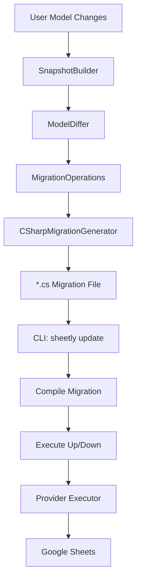
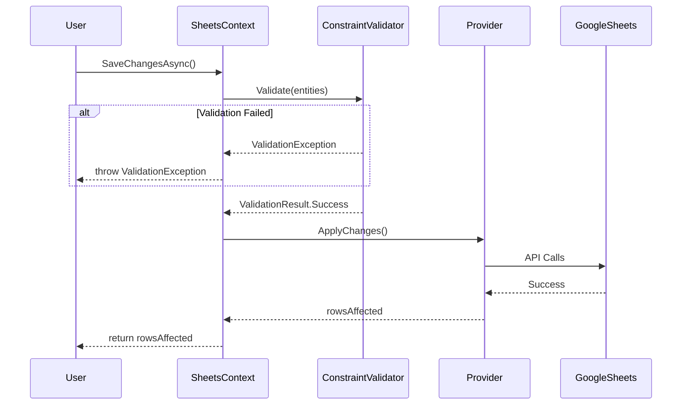

# Migration System Design

## Architecture Overview



## Core Components

### 1. Migration Base Class
```csharp
public abstract class Migration
{
    public abstract void Up(MigrationBuilder builder);
    public abstract void Down(MigrationBuilder builder);
}
```

### 2. MigrationBuilder (Fluent API)
```csharp
builder.CreateTable("Products", table => table
    .Column<int>("Id", c => c.IsPrimaryKey())
    .Column<string>("Title", c => c.IsRequired().HasMaxLength(100))
    .Column<decimal>("Price", c => c.HasDefaultValue(0))
    .Column<int>("CategoryId", c => c.IsForeignKey("Categories")));
```

### 3. Migration Operations
```
MigrationOperation (abstract)
├── CreateTableOperation
├── DropTableOperation
├── AddColumnOperation
├── DropColumnOperation
├── AlterColumnOperation
├── AddForeignKeyOperation
└── DropForeignKeyOperation
```

## SaveChanges Pipeline



## Schema Table Structure

### `__SheetlySchema__`
| Column | Type | Description |
|--------|------|-------------|
| TableName | string | Entity table name |
| Property | string | Column/property name |
| DataType | string | CLR type name |
| IsNullable | bool | Nullable constraint |
| IsPrimaryKey | bool | Primary key flag |
| IsForeignKey | bool | Foreign key flag |
| RelatedTable | string | FK related table |
| DefaultValue | string | Default value |
| LastAutoId | int | Auto-increment tracker |

### `__SheetlyMigrationsHistory__`
| Column | Type | Description |
|--------|------|-------------|
| MigrationId | string | Unique migration ID |
| ProductVersion | string | Sheetly version |
| AppliedAt | DateTime | UTC timestamp |

## Validation Rules

1. **PrimaryKeyValidator** - Unique ID check in local context
2. **ForeignKeyValidator** - Related entity exists (cached)
3. **NullabilityValidator** - Required properties not null
4. **DataTypeValidator** - Type compatibility
5. **MaxLengthValidator** - String length limits
6. **DefaultValueApplicator** - Apply defaults before save
